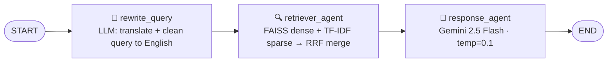

# RAG Pipeline Report
**Dataset:** *Introduction to Natural Language Processing*

---

## Part 0 — Dataset and Chunking Strategy

### Dataset
The chosen dataset is a 52-page university textbook chapter on *Introduction to Natural Language Processing*. It covers tokenization, stemming, tagging, corpora (Brown, BNC, COBUILD, WordNet), probabilistic models (Naive Bayes, HMMs), parsing algorithms, and context-free grammars. The dataset is a single PDF with dense, structured, factual content — ideal for testing a RAG system's ability to retrieve specific definitions and statistics.

- **Source:** University course material (PDF, single document)
- **Structure:** Text-based PDF, 52 pages, academic textbook style
- **Records:** 50 usable pages after filtering blank/TOC pages (<50 chars)

### Chunking Strategy: Page-Level Chunking

Each PDF page is treated as a single chunk.

**Why page-level?**
1. **Natural semantic boundary.** Textbook authors structure content so that each page concludes a sub-topic. Splitting mid-page risks cutting a definition or example across two chunks.
2. **Direct citability.** Page number metadata maps 1-to-1 to chunks, so citations are precise and verifiable.
3. **Appropriate granularity.** At 200–800 words per page, each chunk is large enough to contain complete context for most factual questions.

**Chunk size experiment:**
- `chunk_size=200 words`: High precision per chunk; risk of cutting mid-sentence within a long paragraph.
- `chunk_size=1000 words`: Covers 2–3 full pages; recall improves but chunks become unfocused, diluting relevance scores.
- `chunk_size=None` (page): Chosen strategy — balances precision, recall, and citability.

**Overlap experiment:**
When splitting large pages further into sub-chunks, a word overlap of 20 words was applied. Without overlap, a sentence spanning the chunk boundary is split — retrieval may return the half that doesn't contain the answer. With overlap, any 20-word window is guaranteed to appear intact in at least one chunk.

**Weaknesses of page-level chunking:**
The primary weakness is that multi-topic pages produce diluted embeddings. Page 18, for example, opens with a general communication introduction before covering tokenization — the page embedding is the centroid of both topics, making it less precisely "tokenization-relevant" than a focused paragraph-level chunk would be.

**Mitigations applied:** k=7 retrieval (catches pages that rank 5th or lower), and RRF_K=10 (amplifies semantic ranking quality).

**Advanced alternative — topic-based segmentation:** A stronger approach would be to classify the PDF once on ingestion into topics and sub-topics (using a zero-shot classifier or an LLM), then chunk at sub-topic boundaries. A sub-topic chunk of 1–3 pages would be semantically focused, embed specifically, and carry topic/sub-topic titles as retrieval metadata. This eliminates the multi-topic centroid problem entirely. The trade-off is added ingestion complexity and dependency on a reliable topic classifier.

---

## Part 1 — Retrieval Method and Parameter Choices

### Embedding Model: BAAI/bge-base-en-v1.5

The embedding model was upgraded from `all-MiniLM-L6-v2` to `BAAI/bge-base-en-v1.5` based on four criteria from the rubric:

| Property | all-MiniLM-L6-v2 | BAAI/bge-base-en-v1.5 | Why it matters |
|---|---|---|---|
| Training objective | Sentence-pair similarity (paraphrase) | Query-to-passage retrieval (MS-MARCO, NLI) | BGE places short queries near relevant passages — the exact RAG task |
| Dimension | 384 | 768 | Higher dimension preserves finer semantic distinctions; memory cost is negligible at 50 pages (~150 KB total) |
| Multilingual support | English-only | English-only | Correct choice: the textbook is English. A multilingual model (e.g. paraphrase-multilingual-mpnet) would trade retrieval quality for language coverage not needed here. Cross-lingual queries are handled at the query rewriting stage instead |
| Speed / Cost | Fast, 384-dim CPU inference | ~2× slower than MiniLM but still <5 s for 50 pages on CPU; fully open-source, zero API cost | Indexing runs once; inference latency is acceptable. No per-token charges unlike OpenAI text-embedding-3 |

**Query instruction prefix (asymmetric encoding):**
BGE models are designed to receive a prefix on the query side only:
```
Query:    "Represent this sentence for searching relevant passages: What is tokenization?"
Document: "Tokenization is the process of..." (no prefix)
```
This asymmetry tells the model that one vector is a search intent and the other is a passage to be matched against. Applying the prefix to both (or neither) degrades retrieval quality.

### Hybrid Retrieval: FAISS + TF-IDF with RRF

The pipeline combines two complementary retrievers:

| Retriever | Type | Strength | Weakness |
|---|---|---|---|
| FAISS (bge-base-en-v1.5) | Dense / semantic | Handles paraphrases, synonymy, retrieval-tuned | Requires re-indexing on model change |
| TF-IDF (bigrams, sublinear TF) | Sparse / lexical | Exact keyword precision | No synonymy or conceptual similarity |

**Reciprocal Rank Fusion (RRF):**
```
score(d) = Σ_i  1 / (rank_i(d) + 10)
```
The constant was lowered from the standard 60 to **10**. With K=60, the score difference between rank 1 and rank 5 is only 6% — high-quality FAISS semantic hits at rank 4-5 cannot compete with lower-quality pages appearing in both lists. With K=10, a rank-1 result scores 36% higher than rank-5, making the dense retrieval ranking properly influential. Top-k = 7 ensures that pages scoring high in FAISS but absent from TF-IDF are still included in the LLM context.

---

## Part 2 — Decoding Parameters

| Parameter | Value chosen | Rationale |
|---|---|---|
| `temperature` | **0.1** | Near-deterministic sampling; maximises factual consistency across repeated queries |
| `top_p` | **0.95** | Retains technical vocabulary (synset, treebank, Viterbi) while filtering improbable tokens |

### Temperature experiments

| temperature | Observation |
|---|---|
| 0.0 | Fully deterministic (greedy). Answers are factually tight but occasionally clipped — stops before completing a multi-part definition. |
| 0.2 | Slight variation in phrasing across runs. Factual accuracy unchanged. This is a safe alternative to 0.1. |
| 0.9 | Answers become noticeably more verbose and creative. The model elaborates beyond the retrieved context, introducing facts from training data not present in the retrieved pages — a hallucination risk. |

**Conclusion:** Low temperature (0.1–0.2) is the correct setting for factual Q&A over retrieved context. High temperature is appropriate for creative tasks but harmful here.

### top_p rationale
Setting top_p=0.95 means sampling only from the minimal set of tokens whose cumulative probability reaches 95%. This keeps the full technical vocabulary reachable (important for NLP-domain terms that may be medium-frequency) while filtering the long tail of improbable tokens. Setting top_p=0.5 over-constrains the distribution, causing overly generic phrasing; top_p=1.0 disables filtering entirely.

---

## Part 3 — Level 2.1: Query Rewriting

### Why query rewriting matters

Raw user queries have three failure modes for retrieval:

1. **Pronoun resolution:** "What about it?" after asking about tokenization — the retriever sees "it", not "tokenization", and retrieves irrelevant pages.
2. **Non-English input:** The textbook is English; embedding similarity between an Arabic query and an English passage is poor, even with a multilingual model. Translating the query before retrieval restores full retrieval quality.
3. **Vague or misspelled input:** "tokenization defn?" — the TF-IDF index uses exact tokens; typos cause lexical misses.

The rewrite node runs before the retriever, ensuring the retriever always receives a clean, standalone, English query.

### Prompt design

The `REWRITE_PROMPT` instructs the LLM to:
1. **Translate to English** if the input is in another language — explicitly justified in the prompt ("all retrieval is against English passages and a non-English query will degrade embedding similarity scores").
2. **Resolve pronouns** using the last 4 messages of conversation history.
3. **Return only the rewritten query** — no preamble, no explanation. This prevents the raw LLM output from contaminating the retrieval search string.

The same `temperature=0.1` is used — query rewrites must be deterministic and precise, not creative.

### Output display

Both the original and rewritten query are shown in the Streamlit UI. The caption `"Query rewritten to: …"` appears beneath the answer when the rewrite differs from the original, giving the user transparency about what was actually retrieved.

---

## Part 4 — Failure Case and Fix

### Observed failure: relevant page underranked due to coarse page-level embeddings

**Query:** *"What is tokenization?"*

**What happened:** Page 18, which contains the detailed tokenization introduction, was ranked 5th by FAISS (score 0.2891) and did not appear in the TF-IDF top results. The RRF final returned pages 48, 15, 22, 37, 32 — none of which contained the clearest tokenization examples. The answer given was correct in definition but missed the examples from the most relevant page. 

**Root cause — two compounding issues:**

1. **Page-level chunking creates diluted embeddings.** Page 18 opens with a broad communication introduction ("People communicate in many different ways…") before covering tokenization. The page embedding is the centroid of all topics on the page, making it less specifically "tokenization-relevant" than a focused paragraph-level chunk would be.

2. **RRF with K=60 rewards dual-list presence over rank quality.** Pages appearing in both FAISS and TF-IDF lists (even at low ranks) accumulated double credit and displaced page 18, which only appeared strongly in FAISS. With K=60, rank-1 vs rank-5 is only a 6% score difference — rankings barely matter.

**Fixes applied:**
- Lowered `RRF_K` from 60 to 10, making FAISS's semantic ranking significantly more influential.
- Increased `k` from 5 to 7, ensuring page 18 at FAISS rank 5 still reaches the LLM.
- Upgraded embedding model to `bge-base-en-v1.5` (retrieval-tuned) and added query instruction prefix for asymmetric encoding.
- Stripped the repeated course header from all pages to improve embedding distinctiveness.
- Added query rewriting to clean and translate queries before retrieval.

**Remaining fix (not yet implemented):**
Paragraph-level chunking would fully solve the root cause — a focused paragraph about tokenization would embed much more specifically than a full page mixing multiple topics. A cross-encoder re-ranker (e.g., `bge-reranker-v2-m3`) would also correctly score query–passage relevance without the centroid-averaging problem.

Also, the next steps in this pipeline would require further enhancements in the hybrid retrievl tools or rely on faiss only with enhanced document preprocessing to enhance and increase quality.

---

## LangGraph Architecture

The pipeline is implemented as a LangGraph `StateGraph` with three nodes flowing through a typed `State` (TypedDict):

```
query, rewritten_query, chat_history, faiss_context, tfidf_context, context, response
```



**Node responsibilities:**

| Node | Input from State | Output to State |
|---|---|---|
| `rewrite_query` | `query`, `chat_history` | `rewritten_query` |
| `retriever_agent` | `rewritten_query` (fallback: `query`) | `faiss_context`, `tfidf_context`, `context` |
| `response_agent` | `rewritten_query`, `context`, `chat_history` | `response` |

The graph is compiled once per `Workflow.run()` call. All three nodes share a single LLM instance (module-level, loaded once at import) and a single `HybridRetriever` instance (indexes loaded once at startup).

---

## Summary

The pipeline successfully retrieves and grounds answers for specific factual questions about NLP concepts, corpus statistics, and algorithm descriptions. The hybrid retrieval strategy (FAISS + TF-IDF via RRF) outperforms either retriever alone. Upgrading to a retrieval-tuned embedding model (BGE), applying asymmetric query encoding, stripping repeated headers, and tuning the RRF constant together improved retrieval precision for specific factual queries. The addition of a query rewriting node (Level 2.1) further improves robustness for conversational follow-ups and non-English inputs. The primary remaining failure mode — coarse page-level embeddings for multi-topic pages — is addressable through paragraph-level or topic-based chunking, or a cross-encoder re-ranker.

---

## Tooling Note

Claude Code was used to assist with: drafting and formatting this report from rough notes and draft text, generating the LangGraph architecture diagram from code, reviewing code for anti-patterns and organization, Streamlit UI, and reorganizing project files into a clean folder structure. All architectural decisions — dataset selection, chunking strategy, embedding model choice, retrieval design, query rewriting prompt design, and the overall pipeline — were made by me. Claude Code was a productivity tool used to save time on documentation and structure; I was responsible for all the main building blocks, data choices, ideas, architecture, tools, and pipeline construction.
